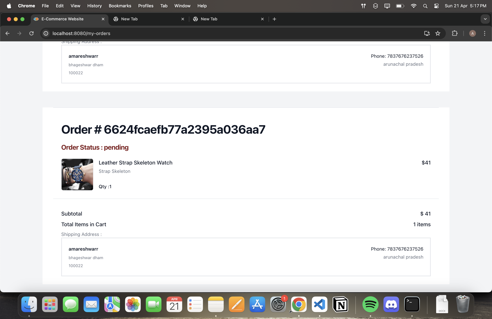

# MERN Stack E-commerce Project

Welcome to the MERN Stack E-commerce project! This project provides a comprehensive example of building a modern e-commerce platform using the MERN stack (MongoDB, Express.js, React, Node.js). Below you'll find details on features, technical implementation, installation guide, and more.

## Features

- **Basic E-commerce Features**: Includes product lists, product details, cart management, and checkout functionality.
- **Secure Payments**: Supports both secure card payments and cash payments.
- **Admin Panel**: Allows administrators to add/edit orders and products.
- **Query Optimization**: Utilizes sorting, filtering, and pagination queries using Mongoose for improved performance.
- **Authentication**: Implements authentication with Passport JS strategies, including API authentication using Passport JWT.
- **Email Notifications**: Sends order and reset password emails to users.
- **User Profiles**: Provides user profile management and order history functionality.

## Technical Details

### Frontend
- React 18 with Tailwind CSS for styling.
- Redux Toolkit with Async Thunk for state management.
- React Router v6 for routing.
- JSON-server for frontend testing.

### Backend
- MongoDB for the database.
- Mongoose v7 as the ODM.
- REST API using Express.js.
- Authentication using Passport JS.

### Additional Services
- MongoDB Atlas for cloud database hosting.
- Vercel for server deployment.
- Email functionality using Nodemailer with Gmail SMTP.
- Payments integration using Stripe with PaymentIntent based custom flow.

## Installation Guide

To set up the project locally, follow these steps:

1. Clone the repository: `git clone https://github.com/akshayyy22/E-Commerce-Backend.git`
2. Navigate to the backend repository: `cd backend`
3. Install dependencies: `npm install`
4. Set up environment variables. You may need to create a `.env` file based on the provided `.env.example`.
5. Start the backend server: `npm start`
6. Navigate to the frontend repository: `https://github.com/akshayyy22/E-Commerce.git`
7. Install dependencies: `npm install`
8. Set up environment variables. You may need to create a `.env` file based on the provided `.env.example`.
9. Start the frontend server: `npm start`
10. Access the application at `http://localhost:3000`

## Screenshots

